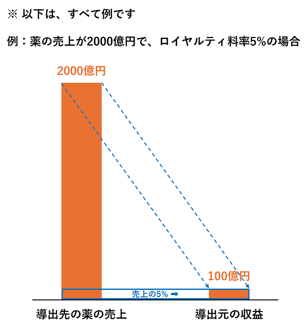

# ビジネスモデル、収益の仕組み

ラクオリア創薬のビジネスモデル、収益の仕組みについての説明です。

## ビジネスモデル

ラクオリア創薬（ラクオリアグループ）のビジネスモデルの説明は、2024年10月6日「ストボ・IRカンファレンス 札幌 バイオ関連株特集」の[説明会資料](https://www.raqualia.com/ja/news/news-3366830891221112620/main/0/teaserItems1/01/linkList/0/link/seminar20241006.pdf.pdf)に掲載されています（以下画像）。

この画像によると収益は主に以下の種類があります。

- 契約一時金
- 研究協力金
- マイルストン
- ロイヤルティ

## ロイヤルティ

ロイヤルティの仕組みがわかりづらいため、説明します。

創薬企業では、自社が持っている薬（化合物）の開発や販売の権利を他社に渡すことがあります。  
その理由は、例えば以下があります。

- 薬は開発の段階が進むと開発費が多額になるため、リスクを考慮した場合に、小さな企業では最後まで開発ができないため
- 会社の戦略が変わり、戦略から外れる分野の薬は、自社では開発しないため

ラクオリア創薬も2024年時点では、開発費の理由などで、他社へ薬の開発や販売の権利を渡す戦略を取っています。

その他社へ薬の権利を渡すことを  **「導出」** と言い、権利を渡した先の企業を **「導出先」** と言います。

導出先が導出元の薬を開発し、販売して売れた場合に、薬の売上が発生します。  
その売上の一部を導出元が対価として得ることがあり、その対価のことを **「ロイヤルティ」** と言います。

対価は、薬の売上の何パーセントということが多いです。  
その「売上の何パーセント」を **「ロイヤルティ料率」** と言います。

そのため、ロイヤルティ料率が高い契約ができるほど導出元の収益が大きくなるため、ロイヤルティ料率の数字が重視されます。

上記を表した例が、ラクオリア創薬の2022年2月14日発表の[「事業計画および成長可能性に関する事項（2022年12月期～2024年12月期）」](https://www.raqualia.com/ja/news/news7230348771288802118/main/0/link/library.pdf)に載っています（以下画像）。

図でもっとわかりやすく例を描くと以下になります。

## サブライセンス

サブライセンスとは、薬の開発や販売の権利を渡した先の企業が、さらに別の企業に権利を渡すことです。  
導出の導出みたいな感じです。

例えば、ラクオリア創薬は、tegoprazanをHKイノエンに導出していますが、HKイノエンがさらに別の海外企業に導出しているケースがあります。  

そのような場合は、最初の導出時の契約内容次第なのですが、例えば、以下のような例になることがあります（一例）。

- A社がB社に導出
  - B社がA社に対して、ある国（α国）での薬の開発/販売において払うお金
    - α国に関するロイヤルティ料率：5%
    - α国に関する契約一時金：10億円
    - α国に関するマイルストン：20億円
- B社がC社に導出（サブライセンス）
  - C社がB社に対して、ある国（β国）での薬の開発/販売において払うお金
    - β国に関するロイヤルティ料率：10%
    - β国に関する契約一時金：50億円
    - β国に関するマイルストン：100億円

となっていた場合に、「C社がB社に対して払うお金」と「B社がA社に対して払うお金」が連動するわけではありません（契約内容によっては連動することもあり得ます）。

つまり、例えば、同じ薬の開発/販売でも、B社がC社から50億円の契約一時金や100億円のマイルストンを受け取っても、A社はそれに対する対価が0円のケースもあります。  
ロイヤルティ料率もA社はC社の薬の売上の10%をもらえるわけではなく、3%しかもらえなかったりするケースがあります。

これらは契約条件次第で内容が変わります。  
しかし、契約内容の詳細は非開示のことが多いため、そのような場合は、実際に決算発表の数字を見るまでは、契約条件を推測することが難しいです。
